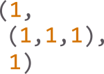

# Overview





Unu is an esoteric programming language with the goal of designing an obfuscated language with a syntax as minimal as possible. It basically has 3 tokens('(', '1', ')') and 2 instructions(2-argument-instruction, 4-argument-instruction)


The name 'unu' is originated from the Esperanto word for a number 1, unu, which clearly describes the visual appearance of the code written in the language.


Below is the Hello world program written in unu. A code in unu mostly looks like this:


```
(1,(((1,(1),(1),(1),1,(1),(1),1),(1,1,(1),1,(1),(1),1,1),(1,(1),
(1),1,1,(1),1,1),(1,(1),(1),1,1,(1),1,1),(1,1,1,1,1,(1),1,1),(1,
(1),(1),1,1,(1),1,(1)),(1,(1),(1),(1),(1),(1),1,(1)),(1,1,1,1,(1
),1,1,1),(1,1,1,1,1,(1),1,1),(1,(1),1,(1),(1),1,1,1),(1,(1),(1),
1,1,(1),1,1),(1,(1),(1),1,(1),(1),1,1),(1,1,(1),(1),(1),(1),1,(1
)),(1,(1),(1),(1),(1),(1),(1),(1))),(1,1),(((((1),1),(1,1,1)),1,
(((((((1,1,1),1,1),1,1),1,1),1,1),1,1),1,1),1),(((((1),(1,1,1)),
(((1),1),1)),(1,1,1)),1,1,1),(1,(1,1,1),((1),(1,(((1,1,1),1,1),1
,1),1))),((((1),1),1),(((1),1),1),((1,1,1),1,1),1),(((((1),(1,1,
1)),((((1),1),1),1,1)),(1,1,1)),(1,1,1),((1),(1,((1,1,1),1,1),1)
))),((((((1),(1,1,1)),(((1),1),1)),(1,1,1)),((((1),(1,1,1)),(((1
),1),1)),(1,1,1)),((1,1,1),((((1),(1,1,1)),(((1),1),1)),(1,1,1))
,1),1),(((((1),(1,1,1)),(((1),1),1)),(1,1,1)),((((1),(1,1,1)),((
(1),1),1)),(1,1,1)),((1,1,1),((((1),(1,1,1)),(((1),1),1)),(((1),
1),(1,1,1))),1),1),((((1),1),(1,1,1)),(((1),1),(1,1,1)),1,((1),(
1,(((1,1,1),1,1),1,1),1)))),(((((1),1),1),(((1),1),1),((1,1,1),1
,1),1),(((1,1,1)),((((1),(1,1,1)),((((1),1),1),1,1)),(1,1,1)),(1
,1,1),((1),(1,((((1,1,1),1,1),1,1),1,1),1))))),((((1),1),1),1,1,
1),(1,(1,1,1),((1),(1,((1,1,1),1,1),1))),((((1),1),1),1,1,1),(1,
(1,1,1),((1),(1,((((1,1,1),1,1),1,1),1,1),1))))
```


Unu is homoiconic language whose code has the same representation with the data it treats. Since it does not offer a memory other than the program itself, the Program should be modifying itself to deal with the data.


Because of this feature, code and data is not logically seperated in unu. So the language offers a challenging experience of designing a software through the spaghetti made of code and data.


# Data structure


Unu offers 'List' as its only data structure. List is an array that contains integer or another lists as an item, and basically not limited in size.


list example:


```
(1, 1)

(1, (1, 1, 1), 1)

(1, ((1, 1), 1, 1), 1, 1)

etc...
```


Note: List itself can contain any integer, but the interpreter only interpretes the number 1.


Note: Only '(', '1' and ')' are the valid token in unu. comma, space and line feed can be freely inserted for legibility.


List's size is set when the code is interpreted, and fixed during the program.


# Interpretation


Unu interpreter reads and converts code into a list, then interprete each item as an instruction.


For example:

```
(1, 1, (1, 1, 1), (1, (1, 1), 1))
```


Code above is interpreted as four instructions: 1, 1, (1, 1, 1), (1, (1, 1), 1).

Line feed can be inserted in each instruction for legibility.


```
(
    1,
    1,
    (1, 1, 1),
    (1, (1, 1), 1)
)
```


#  Instructions


Each instruction is interpreted as following rule:


### List with 1 or 2 items, 'two-argument-instruction' ([r, ]i):

Returns the ith item reference from the list reference r.

Argument r can be omitted to be set to the reference of the program code.


### List with 3 or 4 items, 'four-argument-instruction' ([d, ]a, b, s):

Calculate a's integer value(0 if not integer) minus b's integer value(0 if not integer) and store to integer reference d. (ignored when not integer reference)

if the calculated result is bigger than 0, List s is interpreted as a list of instructions. (ignored when not list)

Argument r can be omitted to be set to the reference of the program code.


### Any other types of item:

Interpreted as constant value. Basically ignored.


Arguments of the instruction is recursively interpreted as another instruction until the interpreter reads the constant value.

For example, arguments of instruction (((1, 1, 1)), ((1, 1, 1)), (1, 1, 1), 1) is interpreted to instruction ((1, 1, 1)), ((1, 1, 1)), (1, 1, 1) and 1, and ((1, 1, 1)) is again interpreted to instruction (1, 1, 1).


# Counting in unu


Four-argument-instruction is useful when it comes to counting in unu. It is basically representing all integer numbers with 1 and minus.

For example, 0 can be represented as 1-1, 2 as 1-((1-1)-1), 3 as 1-(((1-1)-1)-1)...

This can be translated to four-argument-instruction, since a-b can be translated to (a, b, 1). So 0 = (1, 1, 1), 2 = (1, ((1, 1, 1), 1, 1), 1), 3 = (1, (((1, 1, 1), 1, 1), 1, 1), 1).


# Input and Output


Unu basically uses memory mapped io. Interpreter detects when the program writes to 0th item of itself and performs input and output.

This is why most of the unu codes keeps the 0th item to be 1. This item should be integer in order to perform four-argument-instruction write on it.


```
'''
(
    1, #p[0]. input/output data goes here.
    #From now on, nth item of program code will be represented as p[n].
    (((1, 1, 1)), ((1, 1, 1)), 1, 1) # (p[0], p[0], 1, 1). outputs (ASCII input - 1).
)
'''
```


unu can read one ASCII code per one read of p[0], and write one ASCII code per one write on it.


# Four-argument-instruction's argument s and subroutine implementation


Four-argument-instruction's argument s gets list and interpretes it as a list of instructions.

At this time, the argument s can be filled with constant number 1 in order to make the list constant value and avoid recursive interpretation.


```
...
(
    (1),
    (1, 1, 1),
    (
        (((1, 1, 1)), ((1, 1, 1)), (1, 1, 1), 1),
        (1, (1, 1, 1), ((1), ((1, 1, 1), (((1, 1, 1), 1, 1), 1, 1), 1))),
        1,
        1,
        1
    )
)
# four-argument-instruction (p, p[1], 0, argument s). if p[1] - 0 is bigger than 0, (in other word, unconditionally,) value of argument s is interpreted as a list of instructions.
...
```


If you would like to make subroutine that's called repeatedly, you can insert list of instructions as constant number in the code and convey the reference as argument s.

Repeat block can be implemented similarly.


```
(
    1,
    (
        (((1, 1, 1)), ((1, 1, 1)), (1, 1, 1), 1),
        1,
        1,
        1,
        1
    ), # insert subroutine in p[1]. constant number 1 is inserted to avoid recursive instruction interpretation.

    ...

    (1, (1, 1, 1), (1)) # four-argument-instruction (1, 0, p[1]). interprete p[1]'s value as an list of instructions.
    (1, (1, 1, 1), (1)) #now p[1] is called every time this instruction is interpreted.
)
```


# Hello world program


Following is the hello world program in unu.


```
(
	# p[0]: Memory mapped console input/output goes here.
	# I'm going to refer to this item as 'io' from now on.
	1,

	(
		(
			# p[1][0]: Text to be printed. (I'm going to refer to this list as 'str' from now on.)

			# The text is encoded one bit by one in str[n][1:7] (where n = index of the text)
			# in str[n][1:7], the item (1) represents 0 and 1 represents 1. Since list would be
			# evaluated to 0 when it is given as an argument to 4-argument-command.
			
			# The program will read each bit and save decoded ASCII value in str[n][0].

			(1, (1), (1), (1), 1, (1), (1), 1),			# 'H'
			(1, 1, (1), 1, (1), (1), 1, 1),				# 'e'
			(1, (1), (1), 1, 1, (1), 1, 1),				# 'l'
			(1, (1), (1), 1, 1, (1), 1, 1),				# 'l'
			(1, 1, 1, 1, 1, (1), 1, 1),					# 'o'
			(1, (1), (1), 1, 1, (1), 1, (1)),			# ','
			(1, (1), (1), (1), (1), (1), 1, (1)),		# ' '
			(1, 1, 1, 1, (1), 1, 1, 1),					# 'w'
			(1, 1, 1, 1, 1, (1), 1, 1),					# 'o'
			(1, (1), 1, (1), (1), 1, 1, 1),				# 'r'
			(1, (1), (1), 1, 1, (1), 1, 1),				# 'l'
			(1, (1), (1), 1, (1), (1), 1, 1),			# 'd'
			(1, 1, (1), (1), (1), (1), 1, (1)),			# '!'
			(1, (1), (1), (1), (1), (1), (1), (1))		# '\0'
		),
		(
			# p[1][1][0]: Index of a bit the program's reading from each char of str.
			# (I'm going to refer to this item as 'bit' from now on.)

			1,

			# p[1][1][1]: Index of a character the program's reading from str.
			# (I'm going to refer to this item as 'index' from now on.)

			1
		),
		(
			# p[1][2]: Character Convert Subroutine

			# bit = 7
			((((1), 1), (1, 1, 1)), 1, (((((((1, 1, 1), 1, 1), 1, 1), 1, 1), 1, 1), 1, 1), 1, 1), 1),
			
			# str[index][0] = 0
			(((((1), (1, 1, 1)), (((1), 1), 1)), (1, 1, 1)), 1, 1, 1)
			
			# call Bit Convert Subroutine
			(1, (1, 1, 1), ((1), (1, (((1, 1, 1), 1, 1), 1, 1), 1))),
			
			# index = index + 1
			((((1), 1), 1), (((1), 1), 1), ((1, 1, 1), 1, 1), 1),
			
			# If str[index - 1][0] > 0, call Character Convert Subroutine again.
			(((((1), (1, 1, 1)), ((((1), 1), 1), 1, 1)), (1, 1, 1)), (1, 1, 1), ((1), (1, ((1, 1, 1), 1, 1), 1)))
		),
		(
			# p[1][3]: Bit Convert Subroutine
			
			# text[index][0] = text[index][0] + text[index][0]
			(((((1), (1, 1, 1)), (((1), 1), 1)), (1, 1, 1)), ((((1), (1, 1, 1)), (((1), 1), 1)), (1, 1, 1)), ((1, 1, 1), ((((1), (1, 1, 1)), (((1), 1), 1)), (1, 1, 1)), 1), 1),
			
			# text[index][0] = text[index][0] + text[index][bit]
			(((((1), (1, 1, 1)), (((1), 1), 1)), (1, 1, 1)), ((((1), (1, 1, 1)), (((1), 1), 1)), (1, 1, 1)), ((1, 1, 1), ((((1), (1, 1, 1)), (((1), 1), 1)), (((1), 1), (1, 1, 1))), 1), 1),
			
			# bit = bit - 1, and if the calculated value > 0, call Bit Convert Subroutine again.
			((((1), 1), (1, 1, 1)), (((1), 1), (1, 1, 1)), 1, ((1), (1, (((1, 1, 1), 1, 1), 1, 1), 1)))
		),
		(
			# p[1][4]: String Print Subroutine

			# index = index + 1
			((((1), 1), 1), (((1), 1), 1), ((1, 1, 1), 1, 1), 1),

			# io = text[index - 1][0], and if the calculated value > 0, call String Print Subroutine again.
			(((1, 1, 1)), ((((1), (1, 1, 1)), ((((1), 1), 1), 1, 1)), (1, 1, 1)), (1, 1, 1), ((1), (1, ((((1, 1, 1), 1, 1), 1, 1), 1, 1), 1)))
		)
	),

	# index = 0
	((((1), 1), 1), 1, 1, 1),

	# Call Character Convert Subroutine
	(1, (1, 1, 1), ((1), (1, ((1, 1, 1), 1, 1), 1))),

	# index = 0
	((((1), 1), 1), 1, 1, 1),

	# Call String Print Subroutine
	(1, (1, 1, 1), ((1), (1, ((((1, 1, 1), 1, 1), 1, 1), 1, 1), 1)))
)
```
